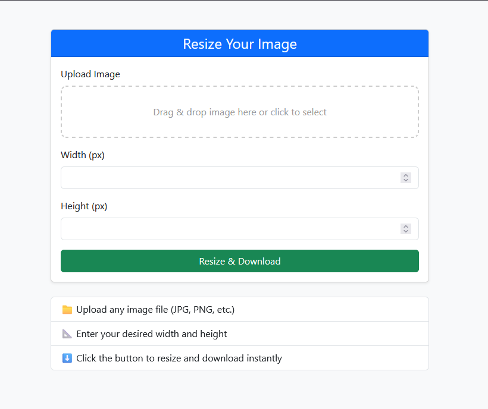
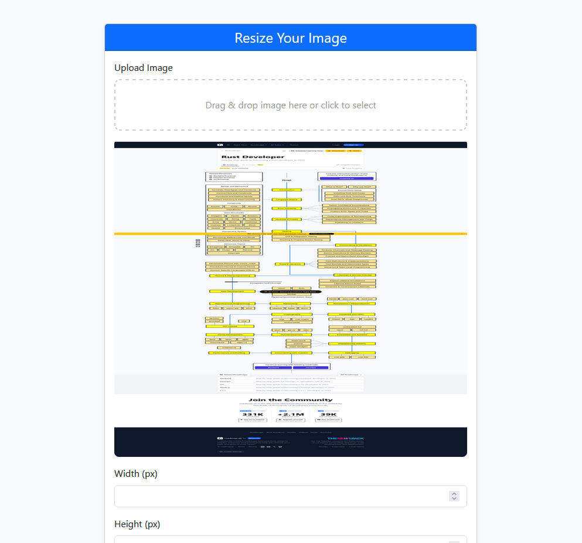

# Django-Image-Resizer-with-Signals
A Django app that automatically resizes uploaded images to 100x100, 300x300, and 600x600 pixels using Django signals. Maintains image quality by leveraging Pillow's advanced resampling methods to prevent quality loss. Easily integrated and customizable for any Django project.

